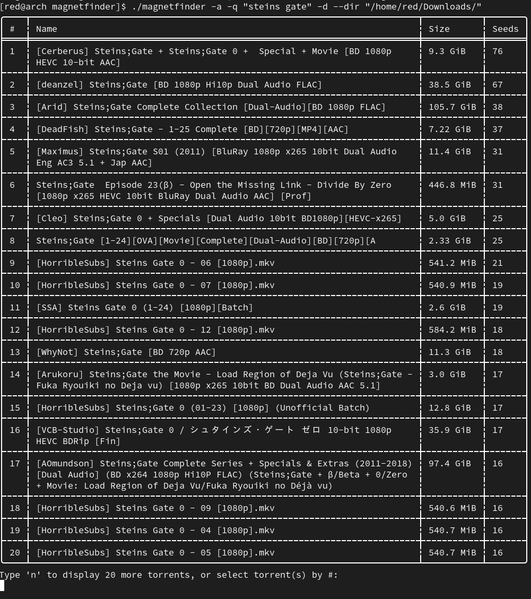

# magnetfinder
grabs magnet links for selected torrents through CLI

Supported Websites:
- nyaa 
- piratebay

Supported torrent client for autodownloads:
- deluge-console



## Installation (from source)
First install rust if you haven't already: https://www.rust-lang.org/tools/install

Download this repository onto your system using ```git clone https://github.com/bleusakura/magnetfinder.git```

Navigate to the directory and run ```cargo run``` for interface use, or ```cargo build --release``` to create a binary to use command line arguments.

## Installation (from binary)
Download the binary from the releases section that correspondes to your system's architecture.

Once downloaded, simply run ```./magnetfinder``` from the directory that you downloaded the binary to.

## Usage
After selecting whether nyaa or piratebay, specify if its a movie or series and give a search query<br/>
In the terminal a table will be presented with the top 20 torrent links sorted by seeders from that website<br/>
Select which torrent by number, and it will either start the download or return the magnet link based on configuration<br/>

## Configure
Edit the Settings.toml file to change the default directories, autodownload status<br/>
Enabling automatic torrent downloads allows deluge-console on linux to run after torrent selection<br/>

Current default directory is your Downloads folder, default status for automatic torrent downloads is false, and default torrent client is deluge-console
